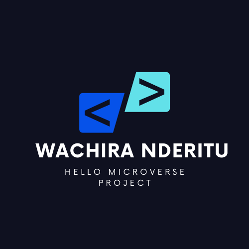

<a name="readme-top">Hello Microverse</a>

<div align="center">
  <!-- You are encouraged to replace this logo with your own! Otherwise you can also remove it. -->
  
  <br/>

  <h3><b>Hello Microverse READMe File</b></h3>

</div>

<!-- TABLE OF CONTENTS -->

# 📗 Table of Contents

- [📖 About the Project](#about-project)
  - [🛠 Built With](#built-with)
    - [Tech Stack](#tech-stack)
    - [Key Features](#key-features)
- [💻 Getting Started](#getting-started)
  - [Setup](#setup)
  - [Prerequisites](#prerequisites)
  - [Install](#install)
  - [Usage](#usage)
  - [Run tests](#run-tests)
  - [Deployment](#deployment)
- [👥 Authors](#authors)
- [🔭 Future Features](#future-features)
- [🤝 Contributing](#contributing)
- [⭐️ Show your support](#support)
- [🙏 Acknowledgements](#acknowledgements)
- [❓ FAQ (OPTIONAL)](#faq)
- [📝 License](#license)

<!-- PROJECT DESCRIPTION -->

# 📖Hello Microverse!<a></a>

**Hello Microverse!** is a html and CSS oriented project that will show mastery of branch and pull functions of the github. 

## 🛠 Built With <a name="built-with"></a>

### Tech Stack <a name="tech-stack"></a>
- HTML
- CSS 
<!-- Features -->

### Key Features <a name="key-features"></a>

- HTML to prepare page layout
- CSS style up
- Linters for error detection
- Repository

<p align="right">(<a href="#readme-top">back to top</a>)</p>

<!-- GETTING STARTED -->

## 💻 Getting Started <a name="getting-started"></a>

- The Hello Microverse project marks the begining of my software journey at Microverse

### Prerequisites

- Git Installed

<!--
Example command:

```sh
 gem install rails
```
 -->

### Setup

- Run terminal on window
- clone my repository

<!--
Example commands:

```sh
  cd my-folder
  git clone git@github.com:myaccount/my-project.git
```
--->

### Usage

- Run on vs studio

### Deployment

- Execute the command prompt 

<!--
Example:

```sh

```
 -->

<p align="right">(<a href="#readme-top">back to top</a>)</p>

<!-- AUTHORS -->

## 👥 Authors <a name="authors"></a>

👤 **wachirasenior0**

- GitHub: [@wachirasenior0](https://github.com/githubhandle)
- Twitter: [@wachirasenior0](https://twitter.com/twitterhandle)
- LinkedIn: [wachirasenior0](https://linkedin.com/in/linkedinhandle)


<p align="right">(<a href="#readme-top">back to top</a>)</p>

<!-- FUTURE FEATURES -->

## 🔭 Future Features <a name="future-features"></a>


- Html / css codes 
- page designs for interative 
- multi language sites for better inclusivity
- linters to help in code functionality 
- Javasript code

<p align="right">(<a href="#readme-top">back to top</a>)</p>

<!-- CONTRIBUTING -->

## 🤝 Contributing <a name="contributing"></a>

Contributions, issues, and feature requests are welcome!

Feel free to check the [issues page](../../issues/).

<p align="right">(<a href="#readme-top">back to top</a>)</p>

<!-- SUPPORT -->

## ⭐️ Show your support <a name="support"></a>

- We welcome feedback and criticism 
- Share with friends and family 

<p align="right">(<a href="#readme-top">back to top</a>)</p>

<!-- ACKNOWLEDGEMENTS -->

## 🙏 Acknowledgments <a name="acknowledgements"></a>

I would like to thank Microverse for making my dream come true. Continue supporting my work

<p align="right">(<a href="#readme-top">back to top</a>)</p>

<!-- FAQ (optional) -->

## ❓ FAQ (OPTIONAL) <a name="faq"></a>


- Did you find the project helpful?

  -_______________

- Would you recommed the project to other people?

  - _______________

<p align="right">(<a href="#readme-top">back to top</a>)</p>

<!-- LICENSE -->

## 📝 License <a name="license"></a>

This project is [MIT](https://choosealicense.com/licenses/mit/) licensed.
<p align="right">(<a href="#readme-top">back to top</a>)</p>
